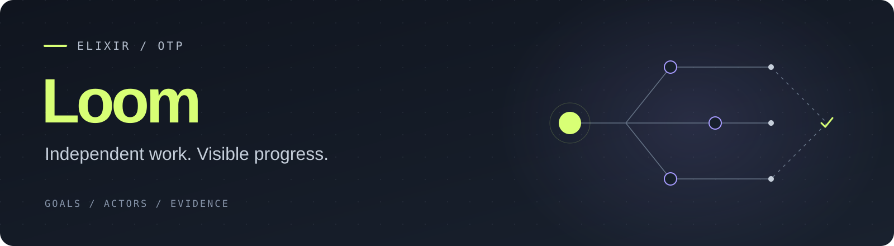

<p align="center">
  
</p>

<p align="center">
  An Elixir/OTP harness for work that deserves more than a chat response.
</p>

<p align="center">
  <a href="#start-with-ion">Get started</a> ·
  <a href="VISION.md">The vision</a> ·
  <a href="ROADMAP.md">What comes next</a> ·
  <a href="docs/operations.md">Operations guide</a>
</p>

## Give it a goal. Stay in control.

Build the feature. Understand the codebase. Edit the document. Follow a longer
goal through to something you can actually use.

Loom is growing into an independent collaborator for code, documents and
long-running work. The ambition is simple: it makes sensible decisions, asks
when your judgment genuinely matters, and verifies the result before calling
the job done. You see **what changed, why, and what remains unfinished**—with
the evidence and individual agents one level deeper.

Built first for one person's workflow, and for others who want that same mix
of independence, reliability and visibility.

> **Early, working foundation—not the finished promise.** Coding tools,
> supervised teams, terminal/browser clients and bounded Word-template filling
> run today, alongside opt-in documentation observers and a local service-backed
> Desk. Broad unattended reliability and cross-machine work remain unproven.

## Why this harness?

**Independence without opacity.** Delegate an outcome, not every keystroke.
Keep the overview readable and the decisions, changes and verification inspectable.

**Useful intelligence, used carefully.** Deterministic tools for mechanical
work. Models chosen for the job. Parallel agents when they help—not to fill a
dashboard. Avoid repeated investigation and needless model calls.

**Actors, not a pile of prompts.** OTP supplies supervision, independent
lifecycles, cancellation and recovery. A model is a resource an agent uses,
not its identity. Several agents can use the same provider and model.

**Knowledge that can change its mind.** Keep useful context in readable files.
Record evidence, uncertainty and why a decision made sense. Revise it when
something better is learned. Knowledge is never a frozen specification.

## Start with ION

ION is the Rust/Ratatui terminal frontend. Build from the repository root with
Elixir 1.19 and compatible OTP (tested with OTP 28), plus Rust 1.88 or newer.
The default service-backed workflow targets macOS; Git is needed for repository
work. Phoenix dependencies are downloaded during the first build:

```sh
mix loom.build
./loom
```

The one-time build prepares ION, Phoenix Desk and the CLI. After that,
`./loom` is all you need; ION is the default. On macOS, it connects to a
long-running local service, reusing a live session in your workspace when available.
The first launch guides
provider setup. To preview the interface without
credentials or model calls:

```sh
./beam_agent_ion --demo
```

After setup, run `./loom doctor` to check the selected provider. In ION,
use `/providers` to manage connections, `/models` to select a model and team
mode, and `Ctrl+P` to discover commands. Start in another repository or document
folder with `./loom tui --workspace /path/to/workspace`. For guarded Word-template edits,
see the [document workflow](docs/document-workflow.md).

File mutations and commands use the `ask` approval policy by default. Explicit
`--approval auto` reduces prompts while retaining runtime safeguards; it grants
broad tool approval, not a special “never push” policy. The vision's default of
leaving publication to you is not yet a separate enforced permission category.
Sandboxed command execution currently has a macOS backend; other platforms
fail closed until an enforcing backend is available.

The original Go TUI remains available with `mix loom.build --frontend go`
and `./loom tui --frontend go`. A terminal-only build can use `--frontend rust`
with the legacy terminal-owned `./loom run` entry point; the service build includes Desk.
See the [operations guide](docs/operations.md) for provider
authentication, saved profiles, line mode, sessions and embedding.

### One model. A useful team.

In a terminal-owned session, keep the selected model while allowing task-based delegation:

```sh
./loom \
  --model-strategy manual --team-mode auto \
  --max-workers 5 --model-concurrency 6
```

This permits an owner and up to five subagents; it does not force five workers
onto every task. Graph work queues behind configured capacity. Concurrent
editors need disjoint path authority or ordered handoffs, and the owner remains
responsible for integration and verification. Model slots are per project pool,
not an account-wide quota. [How teams work →](docs/task-teams.md)

### A desk in your browser

[Loom Desk](cmd/beam_agent_web/README.md) is a separate Phoenix client for
the real authenticated HTTP API: prompt submission, active cancellation,
approvals, actor inspection and live public activity. Start everything together:

```sh
./loom desk
```

Desk opens a **live-session overview**, without creating a work session. Normal
TUI launches publish local connections automatically; click a session to see its
output, agents and approvals. Older running binaries need one restart after
rebuilding to become discoverable.

To attach another terminal to existing work, use the command on its session card:

```sh
./loom attach SESSION_ID
```

Attachments share the existing runtime; they never reopen its storage. Closing an
attached TUI does not stop the owner. `desk --tui` remains a combined-launch
shortcut, and `desk --session ID` opens an already-live session. Browser login
uses a one-use link: no token copying or exports.

The launcher exits; the local service owns the work. Close Desk or an attached TUI
freely. If browser login expires, run `./loom desk` again for a fresh one-time link,
without restarting agents. This is same-user, same-machine control, not network access.

```sh
./loom service status
./loom service logs
./loom service install    # optional: start at macOS login
./loom service stop       # explicitly interrupt work; retain history
```

Service-owned sessions restore idle after a restart; observers restore paused,
and deleted observers remain deleted. Model calls and interrupted edits are not
automatically replayed. Legacy terminal-owned workflows remain available through
`loom run`, `loom resume`, and `loom desk --foreground`.

**Renamed, not reset:** existing `beam_agent` configuration, credentials, session
directories and module/API names remain compatible. `mix loom.build` also builds a
`beam_agent` CLI alias. See [the service guide](docs/loom-service.md) for lifecycle,
login renewal, provider credentials and recovery limits.
[Connection details and limits](cmd/beam_agent_web/README.md).

## What exists—and what we are reaching for

| Area | Working foundation | Next proof |
| --- | --- | --- |
| Delivery | Coding tools, verification, artifact evidence; guarded Word templates with rendering and image-backed model layout assessment | Repeat reliable app/document delivery; broader document support and factual review remain separate |
| Background | [Opt-in documentation observer](docs/documentation-missions.md): bounded assessments, finding cards, explicit isolated fix agents, stop/delete controls | Repeated real-world usefulness without stale reports or wasted allowance |
| Teams | Same-model subagents, task graphs, capacity queues, races and tournaments | Show that the chosen workflow improves useful outcomes without waste |
| Visibility | ION mission/actor/evidence views, live events and replay | Make changes, decision explanations and unfinished work effortless to understand |
| Continuity | Durable sessions, project context, instructions and skills | Share revisable knowledge across sessions and tools without turning notes into rules |
| Reach | Shared runtime API, local multi-session Desk and per-user macOS service | Broader personal coordination and workers on trusted machines |

The long-term shape has two entry points: open a harness inside a workspace,
or open a personal control center that sees work across repositories and
document folders. Background missions—documentation, regressions, investigation—
report to a coordinator. The documentation observer produces read-only advice;
you can explicitly launch a fix agent for a finding in a retained isolated worktree.
It does not merge, commit or push that proposal. Broader mission types and
cross-machine fleet management remain **direction**, not shipped functionality.

## Explore

- [Vision](VISION.md) — what we believe, why, and what remains open.
- [Roadmap](ROADMAP.md) — the next real-world trials and proposed follow-up work.
- [ION field manual](docs/ion-tui.md) — controls and terminal workflows.
- [Desk](cmd/beam_agent_web/README.md) — Phoenix frontend, setup and browser checks.
- [Operations guide](docs/operations.md) — setup, providers, APIs and detailed usage.
- [Architecture](docs/architecture.md) — the runtime and its OTP boundaries.
- [Evaluations](evals/README.md) — reproducible runs and delivery evidence.
- [Earlier roadmap](docs/roadmap-history.md) — preserved history, not a second backlog.

Working on this repository with an AI? Start with [AGENTS.md](AGENTS.md).
For development checks and useful bug reports, see [CONTRIBUTING.md](CONTRIBUTING.md).
Read [SECURITY.md](SECURITY.md) before running agents against sensitive workspaces.

---

The first milestone is not a larger feature list. It is opening the finished
app and edited document and thinking: **yes, it actually did the work.**
